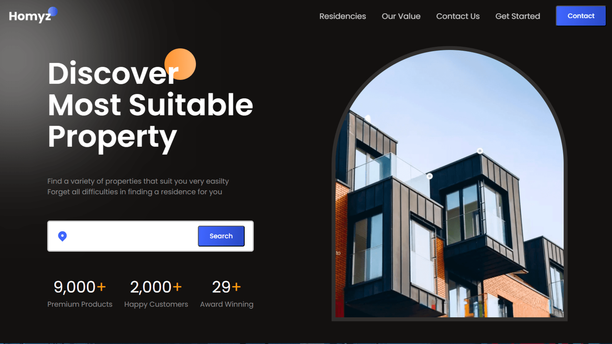

# Homyz — Client Demo (View Only)

Short demo client for a real-estate site built with React and Vite.

IMPORTANT: This is a client-side demo project for viewing purposes only. Do not
use this repository or its contents in production, for distribution, or as a
trusted source of functionality.

What this repo contains
- Frontend React app (client only)
- Vite build config and a small Nginx Docker setup to serve the production build

Quick local view (Docker)
1. Build and start the container:

```bash
docker compose up --build -d
```

2. Open: http://localhost:3000

Stop and remove containers:

```bash
docker compose down
```

Notes
- This repository does not include a backend or production-ready security
  configurations. It is provided for demonstration and review only.
- If you need additional documentation or want this prepared for production,
  contact the maintainer before using it.
# Real Estate React App 

A modern real estate marketplace built with React.js, featuring property listings, animations, and interactive components.

## 🌐 Live Demo
[View Live Demo](http://osa.sakshamjain.codes/)



## ✨ Features
- Property listings with filters
- Smooth animations using Framer Motion
- Image sliders with Swiper
- Interactive counters with React CountUp
- Responsive design
- Accordion FAQs section

## 🛠 Technologies Used
- React.js
- Vite
- Framer Motion (Animations)
- Swiper (Sliders)
- React Icons
- React CountUp
- React Accordion

## 🚀 How to Run

1. **Clone the repo**
   ```bash
   git clone https://github.com/sakshamjain98/osa.git
   ```
2. **Install dependencies**
   ```bash
   npm install
   ```
3. **Start development server**
   ```bash
   npm run dev
   ```
4. Open http://localhost:5173 in your browser

## 🔧 Build for Production
```bash
npm run build
```

## 📁 Project Structure
```
HOMYZ/
├─ public/    # Images    
├─ src/
│  ├─ components/  # Page sections components
│  ├─ utils/       # Local Storage Data
│  └─ App.jsx      # Main component
```

## 🙏 Acknowledgments
- Framer Motion team for animation library
- Swiper.js for touch sliders
- React Icons for icon set
